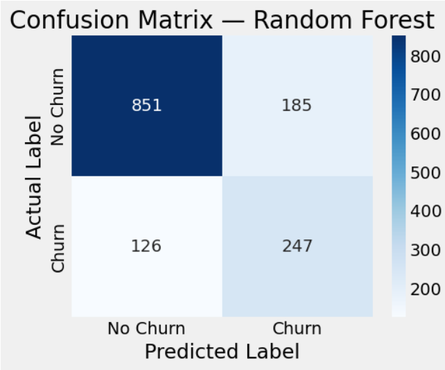
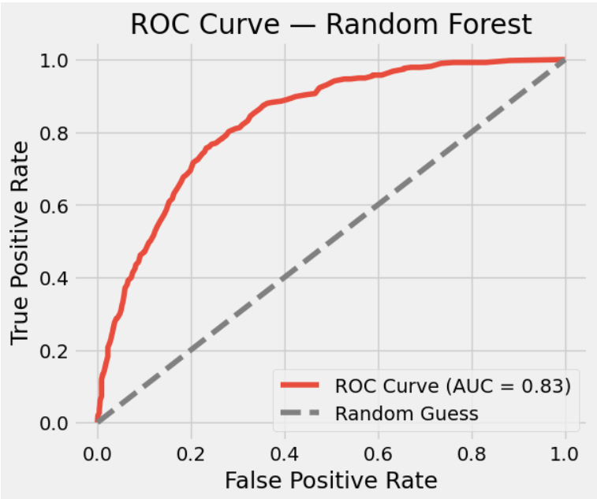
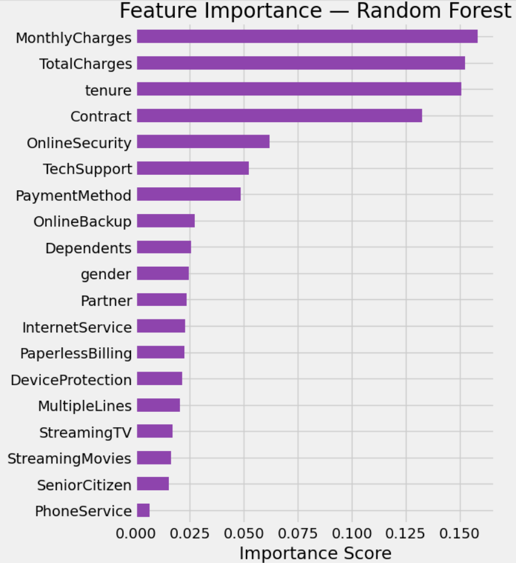
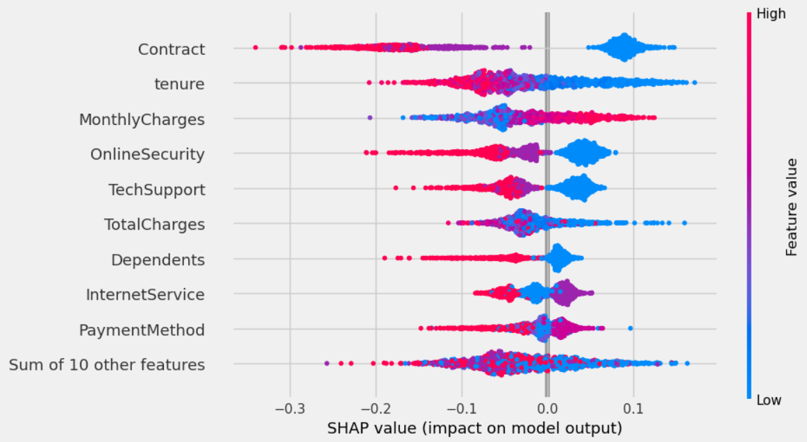

# 📊 Customer Churn Prediction — End-to-End ML Project

## Problem

Telecom companies lose significant revenue when customers churn (cancel their subscription), and acquiring a new customer typically costs far more than retaining an existing one. Without a way to flag at-risk customers early, retention teams are stuck reacting after the customer has already left — instead of intervening in time with offers, outreach, or fixes, built on the [Telco Customer Churn dataset](https://www.kaggle.com/datasets/blastchar/telco-customer-churn).

## Solution

This project builds a machine learning model that predicts, ahead of time, which customers are likely to churn based on their account details, service usage, and billing history. It goes beyond just training a model — the pipeline handles class imbalance (churners are the minority class), tunes multiple algorithms to find the best performer, and uses SHAP to explain *why* the model flags a given customer, so the output is actionable rather than a black box. The result is a reusable prediction function retention teams could plug into a workflow to prioritize outreach to high-risk customers. 

## Overview

This project walks through the full ML lifecycle:

- **Data cleaning** — handled missing/hidden blank values, dropped irrelevant identifiers
- **Exploratory Data Analysis (EDA)** — distributions, correlations, churn patterns across categorical and numerical features
- **Feature engineering** — label encoding of categorical features, standard scaling of numerical features
- **Class imbalance handling** — applied SMOTE to the training set
- **Model training & tuning** — Logistic Regression baseline, Random Forest and XGBoost tuned with GridSearchCV
- **Evaluation** — accuracy, confusion matrix, ROC curve, precision-recall curve, feature importance
- **Explainability** — SHAP values to interpret individual predictions
- **Inference** — a reusable `make_prediction()` function for single and batch predictions, with the model/encoders/scaler persisted via `pickle`

## Results

- **Best model:** Random Forest
- **Test accuracy:** ~78%
- **ROC-AUC:** ~0.74

## Charts    

## Project Structure

```
.
├── Customer_Churn_Prediction.ipynb   # Main notebook (full pipeline)
├── requirements.txt                          # Python dependencies
├── README.md
└── WA_Fn-UseC_-Telco-Customer-Churn.csv      # Dataset (see note below)
```

## Getting Started

1. Clone the repo:
   ```bash
   git clone https://github.com/ranjanmandal-cse/customer-churn-prediction-new.git
   cd customer-churn-prediction
   ```

2. Install dependencies:
   ```bash
   pip install -r requirements.txt
   ```

3. Download the dataset from [Kaggle](https://www.kaggle.com/datasets/blastchar/telco-customer-churn) and place `WA_Fn-UseC_-Telco-Customer-Churn.csv` in the project root (if not already included).

4. Launch the notebook:
   ```bash
   jupyter notebook Customer_Churn_Prediction.ipynb
   ```

## Future Improvements

- Additional feature engineering (tenure groups, avg. spend per service, total services subscribed)
- Try LightGBM, CatBoost, or stacked ensembles
- Optimize the classification threshold for business goals (e.g. maximize recall)
- Add model monitoring / drift detection for production use
- Containerize with Docker and deploy (Flask API + simple frontend) to AWS/GCP/Azure

## License

This project is licensed under the MIT License.
